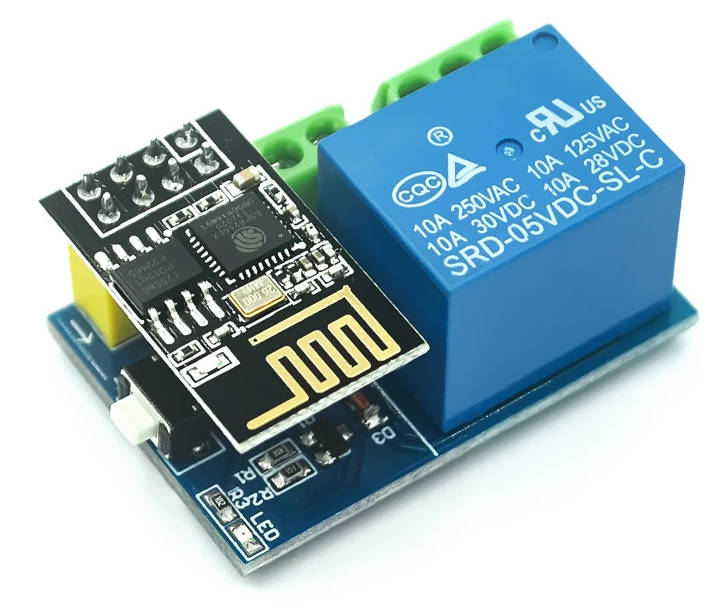

# Zucchini

An el-cheapo small-scale irrigation system for watering my zucchini plant.

It uses an ESP8266 module (the cheap ESP-01 module, to be exact) and a relay board, both of which
can be bought at your favourite chinese marketplace for less than three bucks.  Oh yea and it uses
[micropython](https://micropython.org/).



Together with a small water pump that is driven by the relay, and some hose which I drilled holes
into, this makes for a really ~~feature-rich~~ dead cheap irrigation solution.

It automatically adjusts irrigation time based on the estimated evaporation which depends on the
weather, and supports multiple irrigation events (e.g. in the morning and in the afternoon on hot
days).

Throw in a 5V linear regulator and a 12V/1A power supply to the mix and we're talking less than 20
bucks in total. Yea and hot glue. Always use more hot glue.

And the best is: Of course it's internet of things, and of course it speaks a REST-ish API!

## Usage

Download the "ESP8266 with 1MiB flash" version from [micropython's download
page](https://micropython.org/download/?mcu=esp8266). Erase the chip's flash and flash the firmware,
e.g. using `esptool`.

Attach a serial adapter and set it to 115200 baud. Press enter for a python shell.  Follow [their
guide](https://docs.micropython.org/en/latest/esp8266/tutorial/intro.html) to enable webrepl.

Create `wifi_config.py` with the following lines:

```python
wifi_ssid = 'YOUR WIFI SSID'
wifi_key = 'YOUR WIFI KEY'
```

Use [Webrepl](http://micropython.org/webrepl) to upload the `main.py` and `wifi_config.py` files.

Upon rebooting, the device should connect to your WiFi and expose the following HTTP endpoints:

- `GET /status.json` gives you information about the current state of the system.
- `GET /log.csv` returns a log of past activations.
- `GET /config.json` reads the current config as JSON.
- `GET /factor` retrieves the current irrigation scaling factor for debugging.
- `GET /main.py` delivers the code running on the micro controller, for AGPL compliance.
- `PUT /config.json` sets a new config. See below for the configuration format.
- `POST /ntp` forces the system to re-fetch its time via NTP. Note that this is done on startup
  anyway and should not be neccessary.
- `POST /water?seconds=42` will turn on the pump relais for 42 seconds.

## Configuration

```javascript
{
  "day_length": 86400,          // Optional and mainly useful for testing

  "schedule": [
    {
      "start": 28800,           // When the irrigation starts in seconds after the start of a
                                // day. 28800 = 8 * 3600.

      "duration": 5,            // Irrigation duration in seconds at the reference evaporation. If
                                // the current evaporation is higher(lower), this gets scaled up(down)

      "subtract": 0,            // Optional: Subtract this value from the calculated duration (i.e.,
                                // calculate max(0, duration * factor / 100 - subtract). Default: 0

      "max": 999,               // Optional: Maxium irrigation duration for this event, wo which the
                                // duration is clamped. Default: 10*duration
  ],


  "reference_evaporation": 6,   // Reference evaporation in mm/day.

  "latitude": 49.5529,          // Your location (required for the weather forecast)
  "longitude": 11.0191559,
  "elevation": 279              // Elevation in m above NN
}
```

Note that the `wifi_ssid` and `wifi_key` must be changed by re-uploading the `wifi_config.py` file.

You can split up your desired total irrigation times into multiple events, e.g. one at 10am and one
at 4pm: Create two schedule entries with the same `duration`, but set a `max` value on the first and
the same number as `subtract` value on the second, e.g.:

```javascript
"schedule": [
  {
    "max": 30,         // The first event will run for the calculated time, but at most 30 sec.
    "start": 28800,
    "duration": 55
  },
  {
    "subtract": 30,    // The second event will run for the remainder of the calculated time.
    "start": 57600,
    "duration": 55
  }
]
```

## License

> AGPL, are you serious?!

Dead serious. You can retrieve the source code via HTTP using the `/main.py` endpoint.

---

This is Zucchini, cost-effective™ smart home irrigation solution. Copyright (C)
2022 Florian Jung

This program is free software: you can redistribute it and/or modify it under
the terms of the GNU Affero General Public License version 3 as published by
the Free Software Foundation.

This program is distributed in the hope that it will be useful, but WITHOUT ANY
WARRANTY; without even the implied warranty of MERCHANTABILITY or FITNESS FOR A
PARTICULAR PURPOSE.  See the GNU Affero General Public License for more
details.

You should have received [a copy of the GNU Affero General Public
License](LICENSE) along with this program.  If not, see
<https://www.gnu.org/licenses/>.
